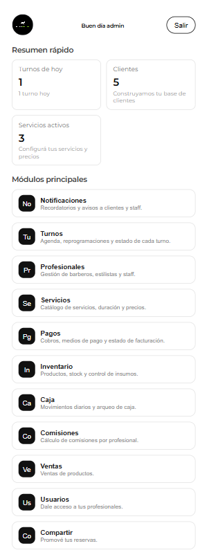
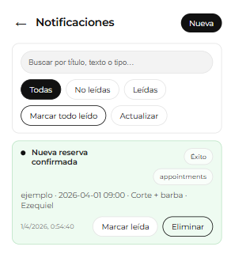
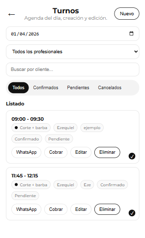

# Booked SaaS

Appointment management platform for businesses.

## Overview

Booked is a multi-tenant SaaS platform built to solve scheduling, reservations and availability management for businesses and professionals.

## Features

- Booking management
- Multi-tenant architecture
- Slug-based access per business
- REST APIs
- Real active clients

## Tech Stack

- PHP
- JavaScript
- MySQL
- REST APIs

## Status

Production product with more than 35 active clients in the first month.

## Screenshots

  

  

  

  

## Live Product

👉 https://booked.blackshark.com.ar
